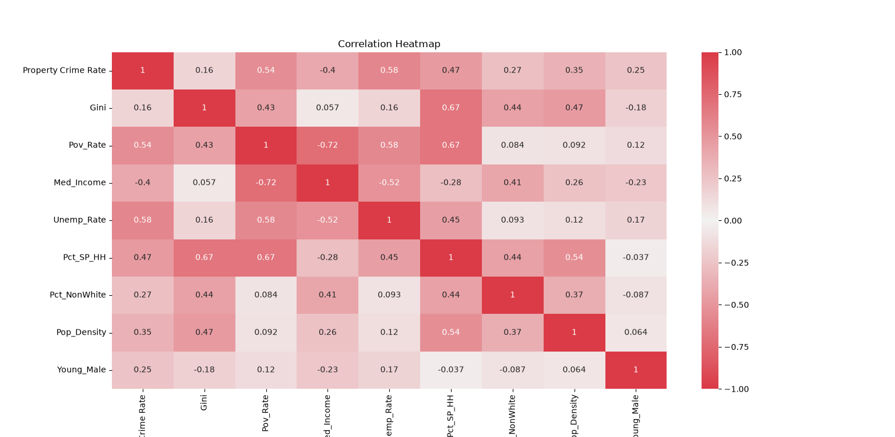
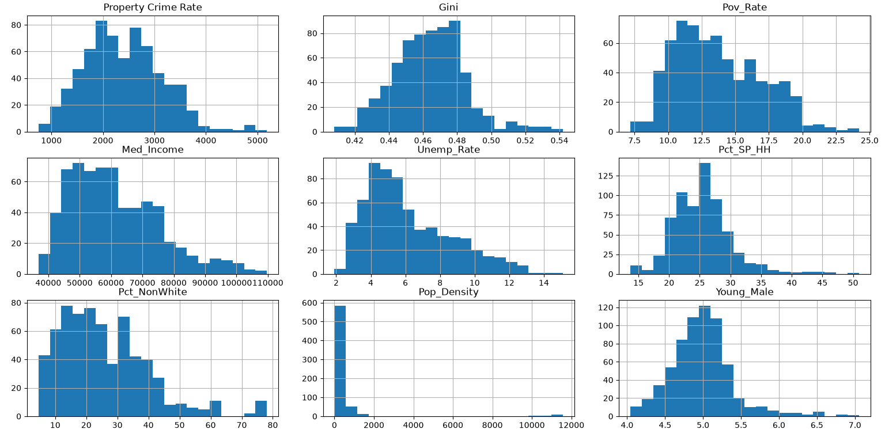
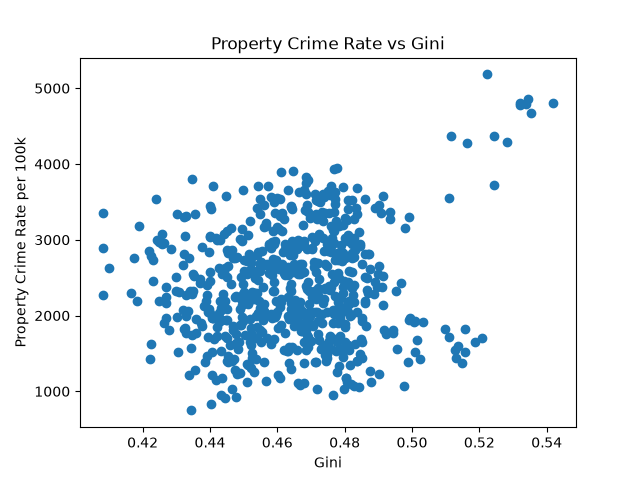
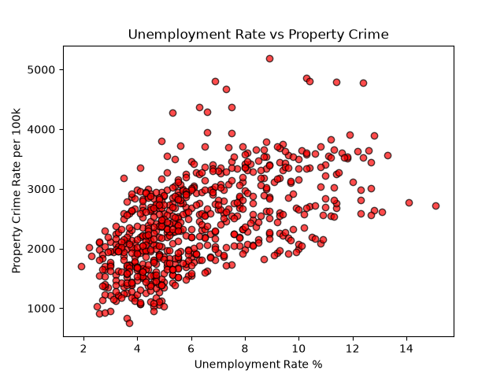
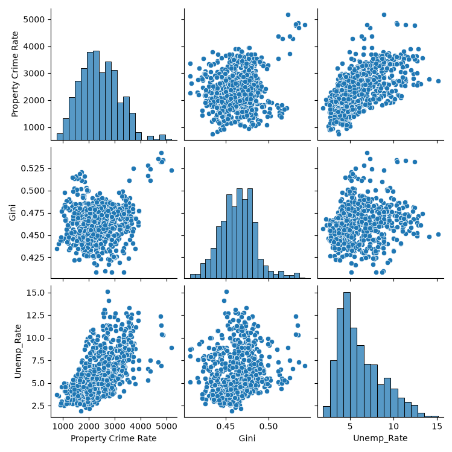

# Property-Crime-Analysis
An statistical analysis of the effect of income inequality and labor market conditions on property crime in the United States 

## Data Pipeline and Methodology 
* `01_download_data.py` : Loads in the Excel dataset. 
* `02_clean_data.py` : Handles data formatting and missing values.
* `03_exploratory_analysis.py` : Conducts initial statistical distributions.
* `04_regression.py` : Executes the core statistical regression modeling.
* `05_visualizations.py` : Generates the visuals shown below. 

## Visualizations 

### Correlation Matrix 
Checking for strong correlation and multicollinearity. 
 

### Variable Distributions 
Quick look at the shape of all variables.
 

### Scatterplots 
Analysis of relationships between key variables 
 
 
 

## Regression Models 

## Power BI Dashboard 
(coming soon) 
